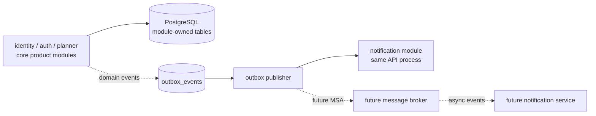

# MSA-Ready Backend Design

이 문서는 `mandalart` 백엔드를 MSA-ready 모듈러 모놀리스로 설계하기 위한 기준을 정리한다. 현재 앱을 `apps/web`으로 옮기는 실행 계획은 [multi-module-migration-plan.md](./multi-module-migration-plan.md)를 참고한다.

## Next Phase Module Flow



이 단계의 핵심은 상세한 모듈 의존성을 늘리는 것이 아니라, 핵심 기능은 기존 API 안에 두고 부가 기능을 이벤트 흐름으로 분리하는 것이다. `notification`은 처음에는 같은 API 프로세스 안의 모듈로 두고, 독립 배포 가치가 생기면 broker 뒤의 별도 서비스로 분리한다.

## Backend Architecture

백엔드는 처음부터 마이크로서비스로 만들지 않는다. 대신 하나의 API 서버 안에서 기능별 모듈 경계를 강하게 둔다.

```text
apps/api/
  src/main/kotlin/com/.../mandalart/
    identity/
      domain/
      application/
      adapter/
        in/web/
        out/persistence/

    auth/
      domain/
      application/
      adapter/
        in/web/
        out/persistence/

    planner/
      domain/
      application/
      adapter/
        in/web/
        out/persistence/

    notification/
      domain/
      application/
      adapter/
        out/email/

    common/
```

초기 기능이 단순하면 Gradle 멀티모듈까지 바로 가지 않아도 된다. 패키지 경계로 시작하고, 모듈 간 의존 규칙이 안정되면 Gradle 멀티모듈로 승격한다.

## Recommended Domain Boundaries

### Identity

회원과 계정의 소유자다.

책임:

- 회원가입
- 사용자 프로필
- 이메일 중복 검증
- 계정 상태 관리
- 비밀번호 해시 저장

소유 데이터 예시:

```text
identity_users
identity_credentials
identity_login_histories
```

### Auth

인증과 세션의 소유자다.

책임:

- 로그인
- 로그아웃
- access token 발급
- refresh token 저장/회전
- 비밀번호 재설정 토큰

소유 데이터 예시:

```text
auth_refresh_tokens
auth_password_reset_tokens
```

`auth`는 `identity`의 공개 application interface만 사용한다. `identity`의 DB 테이블이나 repository를 직접 참조하지 않는다.

### Planner

Mandalart, Block6, Daily, Monthly 같은 계획 도메인의 소유자다.

책임:

- 만다라트 보드 저장
- 셀/목표/색상/스케줄 저장
- Block6, Daily, Monthly 템플릿 저장
- 사용자별 계획 조회
- 공유 링크 또는 협업 기능의 핵심 정책

소유 데이터 예시:

```text
planner_boards
planner_board_cells
planner_templates
planner_shares
planner_daily_entries
planner_monthly_entries
```

### Notification

알림 전달의 소유자다.

책임:

- 회원가입 이메일
- 비밀번호 재설정 이메일
- 공유 초대 알림
- 향후 리마인더 알림

초기에는 같은 API 서버 내부 모듈로 둔다. MSA로 분리할 때 가장 먼저 후보가 될 수 있다.

## Dependency Rules

모듈 간 의존성은 다음 규칙을 따른다.

```text
web -> api-contract -> api

planner -> identity public interface
auth -> identity public interface
notification -> domain events

identity -> planner 참조 금지
identity -> notification 참조 금지
planner -> auth 내부 참조 금지
common -> 특정 도메인 로직 금지
```

금지할 것:

- 다른 모듈의 persistence entity 직접 참조
- 다른 모듈의 repository 직접 호출
- 모든 DTO를 `common`에 몰아넣기
- 여러 모듈이 같은 DB 테이블을 수정하기
- 프론트에서 DB entity 형태를 그대로 API 타입으로 사용하기

## Persistence Strategy

초기에는 단일 PostgreSQL을 사용한다. 단, 테이블 소유권은 모듈별로 분리한다.

```text
identity_*       # identity 모듈만 쓰기 가능
auth_*           # auth 모듈만 쓰기 가능
planner_*        # planner 모듈만 쓰기 가능
notification_*   # notification 모듈만 쓰기 가능
outbox_events    # 이벤트 발행용
```

마이그레이션은 Flyway 또는 Liquibase를 사용한다.

권장 초기 선택:

```text
PostgreSQL
Flyway
Testcontainers
```

나중에 MSA로 분리할 때는 테이블 prefix를 기준으로 서비스별 DB로 이동할 수 있다.

## Event Strategy

처음에는 같은 프로세스 안에서 application event를 사용한다.

예상 이벤트:

```text
UserSignedUp
UserDeleted
PasswordResetRequested
PlannerBoardCreated
PlannerBoardShared
PlannerReminderScheduled
```

중요한 이벤트는 처음부터 outbox 패턴을 고려한다.

```text
business transaction
  -> domain data 저장
  -> outbox_events 저장
  -> publisher가 이벤트 발행
```

초기에는 publisher가 같은 서버 안에서 동작해도 된다. 나중에 Kafka, RabbitMQ, SQS 같은 메시지 브로커로 교체한다.

## API Contract

프론트와 백엔드는 OpenAPI를 기준으로 계약을 관리한다. `mandalart`는 사람이 처음부터 `openapi.yaml`을 직접 작성하는 design-first 방식보다, 백엔드 코드에서 OpenAPI 문서를 생성하고 프론트가 그 문서로 TypeScript client를 생성하는 code-first 방식을 우선한다.

```text
apps/api
  -> Spring Controller 작성
  -> springdoc-openapi로 /v3/api-docs 생성

packages/api-contract
  -> 생성된 openapi.yaml 또는 openapi.json 저장
  -> TypeScript client 생성

apps/web
  -> generated client 사용
```

예상 구조:

```text
packages/api-contract/
  openapi.yaml
  generated/
    typescript-client/
```

운영 규칙:

- 백엔드 API 변경 시 OpenAPI spec을 함께 갱신한다.
- 프론트는 직접 fetch wrapper를 계속 늘리지 않고 generated client를 사용한다.
- 내부 DB entity와 외부 API response DTO를 분리한다.
- generated client는 CI 또는 명시적 script로 재생성한다.

## MSA Separation Strategy

분리 우선순위는 다음이 적절하다.

1. `notification`
2. `identity/auth`
3. `planner`

분리 방식:

- 모듈의 public interface를 HTTP/gRPC API로 교체한다.
- application event를 메시지 브로커 이벤트로 교체한다.
- 테이블 prefix 기준으로 DB를 분리한다.

서비스 분리는 다음 조건 중 일부가 실제로 생겼을 때 진행한다.

- 장애 격리가 필요하다.
- 배포 주기가 다르다.
- 트래픽 패턴이 다르다.
- 팀 소유권이 분리된다.
- DB 테이블 소유권이 이미 분리되어 있다.

## Lessons from storm-apis

`storm-apis`에서 참고할 만한 점:

- `application:*` 모듈이 실행 앱과 조립 책임을 갖는다.
- `parse-core`처럼 core 모듈에 model, port, usecase를 둔다.
- Redis/Object Storage 같은 구현체는 별도 adapter 모듈로 둔다.
- 로컬 개발용 Docker Compose를 적극적으로 사용한다.
- 모듈 의존성 그래프를 문서화한다.

그대로 따라 하지 않을 점:

- 초기부터 너무 많은 모듈로 쪼개지 않는다.
- 프론트엔드를 애매한 standalone 프로젝트로 두지 않는다.
- `common`에 도메인 로직이나 DTO를 과도하게 넣지 않는다.
- core 모듈에 웹 프레임워크 타입이 새어 들어오지 않게 한다.
