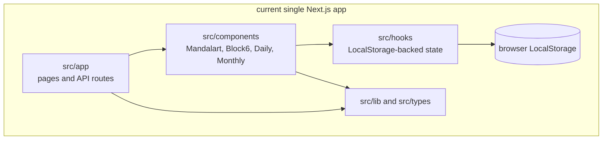
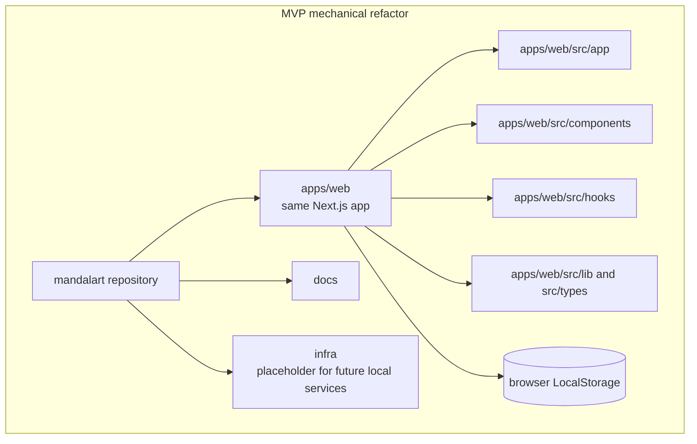

# Mandalart Multi-Module Migration Plan

이 문서는 현재 Next.js 단일 앱을 기능 변경 없이 `apps/web` 중심 구조로 옮기는 실행 계획이다. 백엔드 모듈 경계와 MSA-ready 설계는 [msa-ready-backend-design.md](./msa-ready-backend-design.md)를 참고한다.

## Current Module Flow



현재 구조는 하나의 Next.js 앱 안에 화면, API Route, 컴포넌트, hook, 타입/유틸이 함께 있다. 저장은 브라우저 LocalStorage가 중심이다.

## MVP Module Flow



MVP 단계는 기능 구조를 바꾸지 않는다. 현재 Next.js 앱을 `apps/web`으로 옮기고, 기존 LocalStorage 기반 저장 방식과 Next API Route는 그대로 유지한다. 목적은 이후 `apps/api`, `packages/api-contract`, `infra/docker-compose.yml`을 붙일 수 있는 레포 골격을 만드는 것이다.

## Target Repository Structure

1차 목표 구조는 다음과 같다.

```text
mandalart/
  apps/
    web/                    # 기존 Next.js 앱
    api/                    # Phase 2A부터 추가할 백엔드 앱

  packages/
    api-contract/           # 다음 phase에서 추가할 OpenAPI/generated client

  infra/
    docker-compose.yml      # 다음 phase에서 PostgreSQL 등 로컬 인프라 추가

  docs/
    multi-module-migration-plan.md
    msa-ready-backend-design.md
```

프론트엔드와 백엔드를 별도 레포로 즉시 분리하지 않는 이유는 다음과 같다.

- 초기에는 프론트/백엔드 변경이 함께 일어날 가능성이 높다.
- API 계약 변경과 프론트 반영을 한 PR에서 검증하기 쉽다.
- CI, 로컬 개발, 문서 관리를 한 곳에서 시작할 수 있다.
- 나중에 필요하면 `apps/web`, `apps/api`를 독립 레포로 분리하기 쉽다.

## Migration Phases

### Phase 1. Repository Layout 정리

목표:

- 기존 Next.js 앱을 `apps/web`으로 이동한다.
- 루트에 workspace 설정을 둔다.
- 향후 백엔드와 로컬 인프라를 붙일 디렉터리를 준비한다.

작업:

- `src`, `public`, `next.config.ts`, `package.json` 등을 `apps/web`으로 이동
- 루트 `package.json` 또는 workspace 설정 추가
- 기존 npm script를 `web:dev`, `web:build`, `web:lint`로 정리
- `infra/` 디렉터리 추가

완료 기준:

- `apps/web`에서 기존 앱이 정상 실행된다.
- 기존 e2e 테스트가 web 경로 기준으로 실행된다.
- 기능 동작과 저장 방식은 기존과 동일하다.

### Phase 2. API 서버 추가 준비

Phase 2는 한 번에 API 서버, DB, Flyway, OpenAPI를 모두 붙이지 않는다. 각 작업은 실패 지점과 리뷰 포인트가 다르므로 2A~2E로 나눠 진행한다.

#### Phase 2A. API 앱 스캐폴딩

목표:

- `apps/api`에 백엔드 앱을 추가한다.
- DB 없이 독립 실행 가능한 API 서버를 만든다.
- 도메인 패키지는 미리 만들지 않고, 기능이 생기는 Phase 3 이후에 추가한다.

작업:

- Spring Boot/Kotlin 또는 선택한 백엔드 프레임워크 생성
- Java 21 기준 빌드 설정 추가
- `/api/v1/health` 추가
- 루트 script 또는 문서에 API 실행 방법 추가

생성 구조:

```text
apps/api/
  build.gradle.kts
  src/main/kotlin/com/hadam/plannet/
    PlannetApiApplication.kt
    health/
      HealthController.kt
  src/main/resources/
    application.yml
  src/test/kotlin/com/hadam/plannet/
    PlannetApiApplicationTests.kt
    health/
      HealthControllerTests.kt
```

패키지 기준:

- 2A에서는 `health`만 둔다.
- `identity`, `auth`, `planner`, `notification` 패키지는 실제 기능 구현 시점에 추가한다.
- 향후 도메인 패키지는 `identity/api`, `identity/application`, `identity/domain`, `identity/persistence`처럼 기능 기준으로 먼저 나누고, 내부 계층은 필요할 때 확장한다.

완료 기준:

- API 서버가 단독 기동된다.
- `curl localhost:8080/api/v1/health`가 성공한다.
- PostgreSQL, Flyway, OpenAPI는 아직 붙이지 않는다.

#### Phase 2B. 로컬 인프라 추가

목표:

- PostgreSQL을 로컬 표준 방식으로 띄운다.
- API local profile이 DB에 연결될 수 있게 한다.

작업:

- `infra/docker-compose.yml` 추가
- PostgreSQL service 추가
- local profile datasource 설정
- `.env.example` 또는 문서에 로컬 DB 접속값 정리

완료 기준:

- `docker compose -f infra/docker-compose.yml up -d`로 DB가 뜬다.
- API 서버가 local profile에서 DB에 연결된다.
- 아직 도메인 테이블은 만들지 않는다.

#### Phase 2C. Flyway 기본 마이그레이션

목표:

- DB schema 변경 경로를 만든다.

작업:

- Flyway 의존성 추가
- `apps/api/src/main/resources/db/migration` 추가
- 최소 `V1__init.sql` 또는 schema marker 추가

완료 기준:

- API 기동 시 Flyway migration이 성공한다.
- `flyway_schema_history`가 생성된다.
- `identity_*`, `planner_*` 같은 도메인 테이블은 Phase 3/4에서 생성한다.

#### Phase 2D. OpenAPI 기본 계약

목표:

- 프론트/백엔드 계약을 생성할 수 있는 경로를 만든다.

작업:

- `springdoc-openapi` 추가
- `/v3/api-docs` 노출
- `packages/api-contract/openapi.json` 저장 script 추가
- generated client 사용은 다음 단계로 미룬다.

완료 기준:

- API docs를 조회할 수 있다.
- `packages/api-contract/openapi.json`을 명시적 script로 갱신할 수 있다.

#### Phase 2E. 실행 문서와 운영 스크립트 정리

목표:

- 다음 사람이 web/api/db를 같은 방식으로 실행할 수 있게 한다.

작업:

- README 또는 docs에 API 실행법 추가
- root scripts 정리 (`api:dev`, `api:test`, `api:build`, `api:openapi`)
- Phase 3 진입 조건 명시

완료 기준:

- web/api/db 실행법이 문서화되어 있다.
- Phase 3에서 identity/auth 구현을 시작할 수 있다.

### Phase 3. Identity/Auth 구현

목표:

- 회원가입과 로그인을 서버 저장소 기반으로 구현한다.

작업:

- `identity_users` 생성
- `identity_credentials` 생성
- 회원가입 API 추가
- 로그인 API 추가
- refresh token 저장소 추가
- 비밀번호 해시 정책 적용

완료 기준:

- 사용자가 가입/로그인할 수 있다.
- 프론트에서 로그인 상태를 서버 기반으로 복원할 수 있다.
- 비밀번호 원문은 저장되지 않는다.

### Phase 4. Planner 저장소 전환

목표:

- LocalStorage 중심 데이터를 서버 저장소로 옮긴다.

작업:

- `planner_boards`, `planner_board_cells` 설계
- 기존 LocalStorage 데이터 import API 또는 migration UI 제공
- 보드 저장/조회/수정 API 추가
- 낙관적 업데이트 또는 autosave 정책 정리

완료 기준:

- 로그인 사용자의 만다라트 보드가 서버에 저장된다.
- 새 브라우저에서도 동일 데이터를 조회할 수 있다.
- 기존 LocalStorage 사용자는 데이터 이전 경로가 있다.

### Phase 5. Event/Notification 도입

목표:

- 핵심 기능과 부가 기능을 이벤트 흐름으로 분리한다.

작업:

- application event 규칙 추가
- `outbox_events` 테이블 추가
- `UserSignedUp`, `PlannerBoardShared` 이벤트 발행
- 이메일 또는 알림 모듈 추가

완료 기준:

- 핵심 기능이 알림 전송 실패에 직접 영향받지 않는다.
- notification 모듈은 이벤트를 통해 동작한다.

### Phase 6. Gradle 멀티모듈 승격

목표:

- 백엔드 코드량이 커졌을 때 모듈 경계를 빌드 레벨에서 강제한다.

예상 구조:

```text
apps/api/
  bootstrap/

backend/modules/
  common-core/
  identity-core/
  identity-persistence/
  auth-core/
  auth-persistence/
  planner-core/
  planner-persistence/
  notification-core/
```

완료 기준:

- core 모듈은 persistence 구현체를 모른다.
- persistence 모듈은 core port를 구현한다.
- bootstrap 모듈만 전체 구현체를 조립한다.

### Phase 7. MSA 분리

목표:

- 독립 배포 가치가 생긴 모듈부터 서비스로 분리한다.

분리 우선순위:

1. `notification`
2. `identity/auth`
3. `planner`

분리 조건:

- 장애 격리가 필요하다.
- 배포 주기가 다르다.
- 트래픽 패턴이 다르다.
- 팀 소유권이 분리된다.
- DB 테이블 소유권이 이미 분리되어 있다.

## Initial Checklist

- [x] `apps/web` 이동 계획 확정
- [x] workspace 구조 확정
- [x] 기존 Next.js script 이동 방식 결정
- [x] e2e 테스트 기준 경로 정리
- [x] `infra/` 디렉터리 생성
- [x] 백엔드 기술 스택 확정
- [x] Phase 2A API 앱 스캐폴딩
- [ ] Phase 2B 로컬 PostgreSQL 인프라 추가
- [ ] Phase 2C Flyway 기본 마이그레이션 추가
- [ ] Phase 2D OpenAPI contract 생성 경로 추가
- [ ] Phase 2E 실행 문서와 운영 script 정리
- [ ] LocalStorage 데이터 이전 전략 결정
- [ ] CI에서 web/api build 분리

## Recommended First Implementation Slice

가장 먼저 구현할 단위는 Phase 2A만으로 제한한다. DB, Flyway, OpenAPI는 붙이지 않는다.

```text
1. apps/api 생성
2. Spring Boot/Kotlin 기본 빌드 설정
3. /api/v1/health 추가
4. API 단독 기동 확인
5. root script 또는 README에 실행 방법 추가
```

Phase 2A 완료 후 다음 순서로 진행한다.

```text
2B. PostgreSQL local infra
2C. Flyway migration path
2D. OpenAPI export path
2E. docs and root scripts
```
